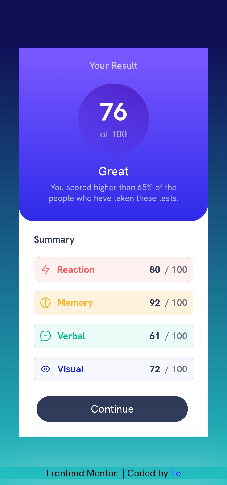

# Frontend Mentor - Results summary component solution

This is a solution to the [Results summary component challenge](https://www.frontendmentor.io/challenges/results-summary-component-CE_K6s0maV) hosted by [Frontend Mentor](https://www.frontendmentor.io/home).

## Table of contents

- [Overview](#overview)
  - [Introduction](#introduction)
  - [The challenge](#the-challenge)
  - [Screenshot](#screenshot)
  - [Links](#links)
- [My process](#my-process)
    - [Built with](#built-with)
    - [What I learned](#what-i-learned)
    - [Continued development](#continued-development)
    - [Useful resources](#useful-resources)
- [Author](#author)
- [Acknowledgments](#acknowledgments)

## Overview

### Introduction

Introducing Result Summary: A data-driven app for understanding your strengths and weaknesses

Result summary is a compitable site for any device that helps you gain insights into your skills and performance through personalized quizzes and data-driven results. Take a variety of tests, see your score compared to others, and get actionable feedback to improve your skills.

### The challenge

Users should be able to:

- View the optimal layout for the interface depending on their device's screen size
- See hover and focus states for all interactive elements on the page

### Screenshot

#### Desktop Design

### Mobile Design

### Links

- Solution URL: [The Project](https://your-solution-url.com)
- Live Site URL: [The Solution](https://your-live-site-url.com)